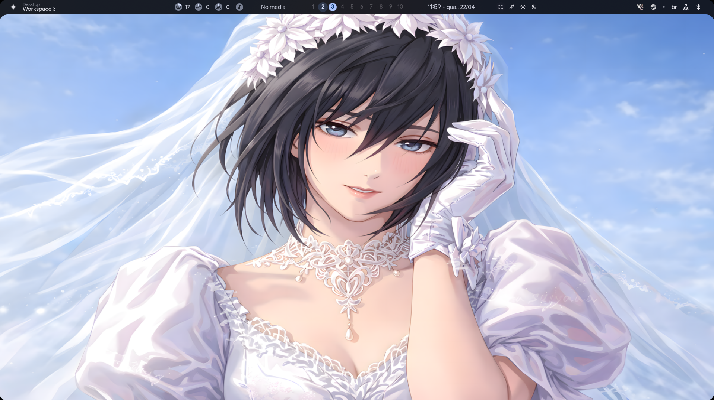
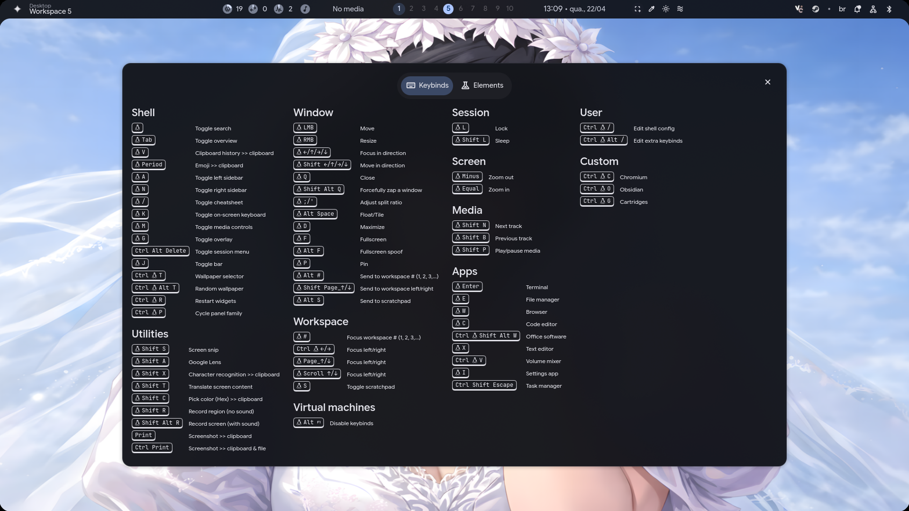

# 🧊 Hyprland Setup

Configuração pessoal usando Hyprland.

## 📸 Preview

---

## ⚙️ Sobre o Setup

Minha área de trabalho utiliza como base um layout pronto do projeto de dotfiles:

🔗 https://github.com/end-4/dots-hyprland

Esse projeto usa:
- Hyprland → https://hyprland.org  
- Quickshell → https://github.com/quickshell-mirror/quickshell  

A partir dessa base, utilizo algumas configurações personalizadas no Hyprland, incluindo:
- Keybinds adaptadas para o meu uso
- Ajustes de comportamento e layout

---

## ⌨️ Keybinds

Também utilizo um arquivo separado:

- `keybinds.conf` (binds personalizadas com interface GUI para visualização)

A interface gráfica para visualizar as binds é disponibilizada graças ao projeto:
https://github.com/end-4/dots-hyprland

Esse sistema permite abrir uma janela com interface personalizada para consultar as binds de forma rápida.

### 📸 Preview das Keybinds

> Adicione aqui uma imagem da interface de binds

---

## 📂 Inclui

- `hyprland.conf` (com minhas binds personalizadas)  
- `hypridle.conf` (controle do modo de suspensão do sistema)  
- `btop.conf` (configurado para transparência no terminal)  
- `keybinds.conf` (binds + GUI de visualização)  
- `kitty.conf` (transparência do terminal pré-configurada)

---

## ⚠️ Aviso

Este setup foi feito para **uso pessoal**.  
A utilização é por sua conta e risco.

---

Ambiente leve, simples e funcional para meu uso diário.
